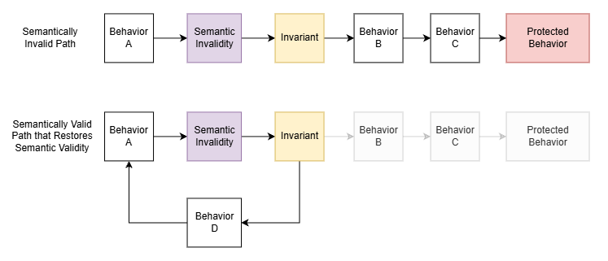
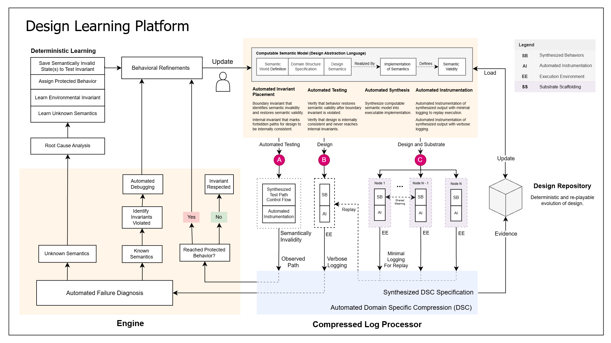

Software systems are an essential part of modern society, and when they fail to function as intended, the implications are enormous. It is therefore vital that systems are built to be resilient to failures. More importantly, if they do fail, the diagnosis of the failure must be swift, both to recover the system and make it more resilient to future failures.

To address this need, in this blog, I will present a framework called the Design Learning Platform (DLP) that fully automates the diagnosis of software failures. First, I will first explore the nature of the design on its own and explain how a closed semantic world can predict and resolve failures. Next, I will talk about how the design is applied to software systems and explain the automation that it enables. Finally, I will talk about how this framework enables the complete automation of software system management and discuss how this is practically achieved by the platform.

# The Design

A design is a closed semantic world. It contains participants whose state is transformed through the design's unambiguous behaviors. When the environment interacts with the design, it introduces a change to the state of the world. This state transition may enable new behaviors, which the design deterministically resolves in response to the updated state, producing further state changes. When resolving a state, the design may either exhibit behavior directly or deterministically select which behaviors are enabled as a reaction to the state. The design continues reacting to each resulting state transition until no further behavior is enabled and the world reaches a stable semantic state. This chain of resolutions constitutes the structure of the design itself and provides the environment a fully specified path through it.

The design is said to be in a semantically invalid state when one of its downstream intentions can’t be realized. When the environment provides an input into this closed world, in order to continue successfully realizing its intentions, the design must prevent semantically invalid states from persisting in its reality. To achieve this, semantic invariants act as markers which identify the semantically invalid state and predict the failure of downstream behaviors. This establishes an invariant path from the semantically invalid state to the behavior that will fail and in order to restore semantic validity, the design must provide a semantically valid path to resolve the state. 

In the first path, since the design does not provide a semantically valid narrative for the environment, the protected behavior is reached. The failure can be automatically debugged because the failure will be predicted by the violated invariant. However, in the second path, the design does provide a semantically valid narrative to restore semantic validity. Using this structure, given a semantically invalid state, the invariant can be automatically tested by walking the path and identifying if the design provides a semantically valid narrative. In this sense, it is also fair to say that semantic invariants protect the downstream behavior because they ensure that the protected behavior can never be reached through the semantically invalid narrative.

If a design is tested to ensure that it respects all its known invariants and it still fails, it means that the environment which caused the failure is revealing unknown semantics that the design must learn through root cause analysis. This automates failure diagnosis because there is no other interpretation of the failure. In this process, the design learns new semantics and invariants that expand the semantics of the design so that it can continue realizing its intentions in its operational environment.

In this sense, through the invariants, the design absorbs the domain knowledge needed to prevent the failures within its closed semantic world. The design itself is reshaped by the invariants to only allow semantically valid narratives to persist. In this process, by working with the design, debugging, testing and failure diagnosis are automated. However, it is clear that the diagnostic automation isn’t a result of complex analysis of the world, instead, it is the result of the world being fully constructed, resulting in unambiguous diagnosis of failures. In this sense, every time the DAL is used to meaningfully eliminate ambiguity in the closed semantic world, a new form of automation will emerge.

## Example

- Provide example of design to demonstrate what was communicated above.
- Use library manager because it is simple and there is 

# Software Systems

- Explain how software systems are the result of an intentional design.
- Explain how a programming language is used to realize the intentional design.
- Explain how by understanding the execution through its design, the automation enabled by the design can be applied to software systems.
- Explain how this can be achieved using a computable semantic model.

### Design Abstraction Language
- Describe how the semantics are represented in the design abstractin lanauage.
- Describe how the implementation of the semantics is mapped onto the transformations in the design. 
- Describe how the the invariants on each transformation can be used to automatically identify the forbidden narratives in this world (through invariants) and test that the design respects them.

### Shared Meaning and Distributed Systems
- Discuss the consequences of a computable semantic model for interaction between software systems.
- Discuss how through shared meaning, larger closed semantic worlds can be constructed.
- Discuss how this frames a distributed system as a closed semantic world built through semantically computable interactions.
- Discuss how the automation enabled by the design rises up to the level of distributed systems because the same principles determine its corretness.

## Design Learning Platform
 - Discuss the how this automation is practically achieved

 

 - Discuss the creation of an engine that leverges the unambiguous computable semantic model to verify the correctness of the design and automatically diagnose software failures and enables the design to learn new semantics through root cause analysis.
 - Describe how the computable semantic model can synthesize implementations that are instrumented with the relevant information.
 - Describe how this solution would not be practical at scale with domain specific compression
 - Describe how Comperssed Log Processor is an open source tool that can be leveraged to solve this problem and that it has been proven at a petabyte scale.
 - Discuss how this enables a design repository that can deterministically replay the evolution of the design.
 - Describe how through the compression and automation, the Design Learning Platform is a fully autoamted and optimized platform.

# Conclusion

- Conclude by communicating how this framework addresses the goal laid out in the introduction. 
- Highlight that this framework doesn't invent anythign new, instead, it simply eliminates the ambiguity in the existing processes through an unambiguous design and enables the automation.
- Conclude by highlighting that this frees up developers to focus on building more effective systems.