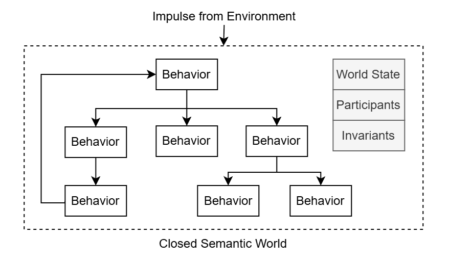
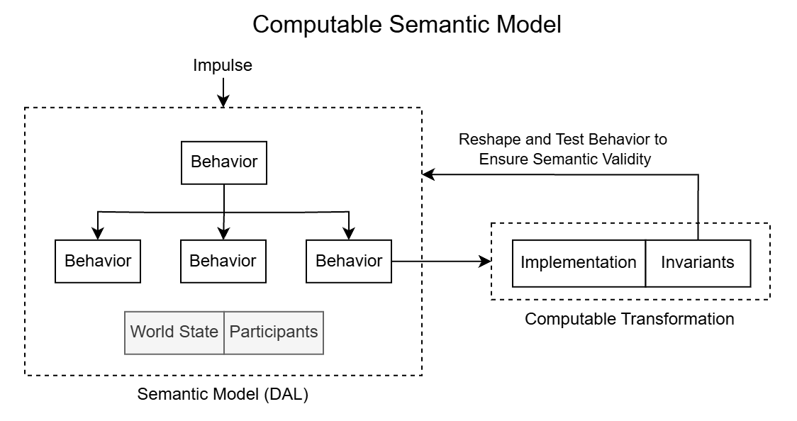
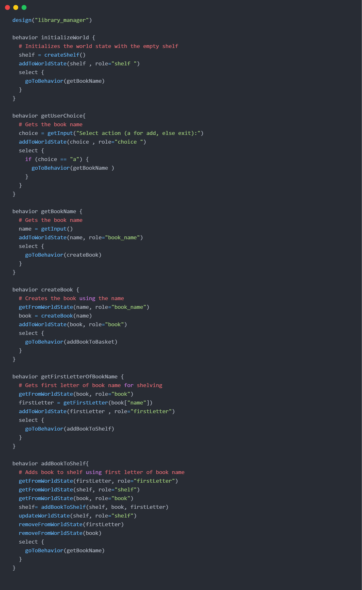

Software systems are an essential part of modern society and, when they fail to function as intended, the implications can be enormous. It is therefore vital that systems are built to minimize the possibility of failure and that, when failures do occur, effective diagnostic processes expedite the systems recovery. 

To address this need, in this blog, I will present a framework called the Design Learning Platform (DLP) that fully automates the diagnosis of software failures. First, I will first explore the nature of the design on its own and explain how a closed semantic world can predict and resolve failures. Next, I will talk about how the design is applied to software systems and explain the diagnostic automation that it enables. Finally, I will talk about how this framework enables the complete automation of software system management and discuss how this is practically achieved by the platform.

# The Design

A design is a closed semantic world. It contains participants whose state is transformed through the design's unambiguous behaviors. When the environment interacts with the design, it introduces a change to the state of the world. This state transition may enable new behaviors, which the design deterministically resolves in response to the updated state, producing further state changes. When resolving a state, the design may either exhibit behavior directly or deterministically select which behaviors are enabled as a reaction to the state. The design continues reacting to each resulting state transition until no further behavior is enabled and the world reaches a stable semantic state. This chain of resolutions constitutes the structure of the design itself and provides the environment a fully specified path through it.

The design is said to be in a semantically invalid state when one of its intentions can’t be realized as a result of the state. When the environment provides an input into this closed world, in order to continue successfully realizing its intentions, the design must prevent semantically invalid states from persisting in its reality. To achieve this, semantic invariants act as markers which identify the semantically invalid state and predict the failure of downstream behaviors. This establishes an invariant path from the semantically invalid state to the intention that can’t be realized and in order to restore semantic validity, the design must provide a semantically valid path to resolve the state.

Since the design is completely unambiguous and semantic in nature, another valid way to represent it as potential narratives within a closed semantic world and I will be using this framing in the rest of this document because it is more accessible. These narratives can be constructed by identifying the participants involved, the transformation being applied and the decisions that were made. When an environment provides an impulse into the design, a specific narrative is selected in this world. When looked at in this way, a semantically invalid path can be seen as a narrative that must be eliminated from the potential narratives of this closed semantic world and instead, the design must provide a semantically valid narrative for the environmental impulse as it moves through the design. By only allowing semantically valid narratives in the closed semantic world, the design eliminates failures with respect to all the known invariants.

In the first path, since the design does not provide a semantically valid narrative for the environment, the protected behavior is reached. The failure can be automatically debugged because the failure will be predicted by the violated invariant. However, in the second path, the design does provide a semantically valid narrative to restore semantic validity and the potential bug is eliminated. Using this structure, given a semantically invalid state, the invariant can be automatically tested by walking the path and identifying if the design provides a semantically valid narrative. In this sense, it is also fair to say that semantic invariants protect the downstream behavior because they ensure that the protected behavior can never be reached through the semantically invalid narrative.

Since a design is a closed semantic world, the invariants intrinsic to the design can be identified through the control flow and data dependencies within the design's structure. As such, the design intrinsic invariants are identified by definition and the behavior of the design can be modified to ensure that it respects every invariant and is internally consistent. 

If a design is tested to ensure that it respects all its known invariants and it still fails, it means that the environment which caused the failure is revealing unknown semantics that the design must learn through root cause analysis. This automates failure diagnosis because there is no other interpretation of the failure. In this process, the design becomes progressively more intelligent as it learns new semantics and invariants so that it can continue realizing its intentions in its operational environment.

In this sense, through the invariants, the design absorbs the domain knowledge needed to prevent the failures within its closed semantic world. The design itself is reshaped by the invariants to only allow semantically valid narratives to persist. In this process, by working with the design, debugging, testing and failure diagnosis are automated. However, it is clear that the diagnostic automation isn’t a result of complex analysis of the world, instead, it is the result of the world being fully constructed, resulting in unambiguous diagnosis of failures. In this sense, every time ambiguity is eliminated in a meaningful way in the closed semantic world, a new form of automation will emerge.

## Example

- Provide example of design to demonstrate what was communicated above.
- Use library manager because it communicates the essential ideas without adding too much complexity.

# Computable Semantic Model

Software systems are the result of an intentional design.The design is realized through an implementation in a programming language, which uses its abstractions to realize the design’s intentions. Therefore, the meaning behind the mechanical implementation in a programming language is established by the design of the system. Through this process of understanding the execution through the design, the automation enabled by the design is inherited by any diagnostic tool for software systems.

This is achieved by establishing the design as a Computable Semantic Model (CSM) in a Design Abstraction Language (DAL). A CSM is built by establishing the design structure and its transformations unambiguously in the DAL and then defining the implementation which realizes the meaning established by the design. This effectively means that the implementation exists in the context of its role in the design and any invariants specified by the implementation can be enforced by the design.

 

This process of establishing the design and its implementation through the CSM means that the invariants established by the implementation of the transformation can reshape the permitted narratives in the world to prevent failures. It also provides a means to automatically test that the design's behavior respects the invariants specified by the transformation, effectively eliminating known failures by construction.

Before continuing with the larger implications establishing software systems are computable semantic models, I will briefly discuss the Design Abstraction Language and how it enables the computable semantic model to be built. I will also describe how the invariants can reshape the narratives of the closed semantic world. 

### Design Abstraction Language

The Design Abstraction Language (DAL) is a declarative language that enables the specification of closed semantic worlds. The scope of language is determined by any mechanism needed to faithfully represent the design such as the behaviors, participants, control flow and invariants. 

An example of a script written in DAL is provided below:
 

While this is a very simple design, it does contain enough functionality to demonstrate how the language establishes a design. In the next section, it will be used to demonstrate how the invariants specified in the implementation of the semantics can be used to reshape the behavior of the design to eliminate semantically invalid narratives.

### The Design
- Use the example above to demonstrate how the design is specified.
- Talk about the world state, participants and the role in the design.
- Talk about behaviors and how they transform the world state in an unambiguous way.
- Talk about how behaviors select the next behvior to be exhibited (or to exit)

### Implementation of Semantics 
- Describe how the implementation that realizes the meaning of the semantics is specified.
- Describe how the invariants that identify ways in which the transformation can fail are specified.
- Describe how this makes the specified design executable 
- Describe how you need to log minimal information to replay an execution because deterministic transformations can be recreted.

### Reshaping Design using Invariants
- Establish how the invariants can be used to identify the invariant paths using the design structure
- Describe algorithm to automatically place invariants for all combination of participants
- Describe how the invariant path must be modified to provide a semantically valid path of the invalid narrative
- Establish how invariants can be automatically tested using this process

## Shared Meaning and Distributed Systems
- Discuss the consequences of a computable semantic model for interaction between software systems.
- Discuss how through shared meaning, larger closed semantic worlds can be constructed.
- Discuss how this frames a distributed system as a closed semantic world built through semantically computable interactions.
- Discuss how the automation enabled by the design rises up to the level of distributed systems because the same principles determine its corretness.

## Design Learning Platform
 - Discuss the how this automation is practically achieved

 

 - Discuss the creation of an engine that leverges the unambiguous computable semantic model to verify the correctness of the design and automatically diagnose software failures and enables the design to learn new semantics through root cause analysis.
 - Describe how the computable semantic model can synthesize implementations that are instrumented with the relevant information.
 - Describe how this solution would not be practical at scale with domain specific compression
 - Describe how Comperssed Log Processor is an open source tool that can be leveraged to solve this problem and that it has been proven at a petabyte scale.
 - Discuss how this enables a design repository that can deterministically replay the evolution of the design.
 - Describe how through the compression and automation, the Design Learning Platform is a fully autoamted and optimized platform.

# Conclusion

- Conclude by communicating how this framework addresses the goal laid out in the introduction. 
- Highlight that this framework doesn't invent anythign new, instead, it simply eliminates the ambiguity in the existing processes through an unambiguous design and enables the automation.
- Conclude by highlighting that this frees up developers to focus on building more effective systems.